# 🇰🇭 Cambodia GDCE Multi-Pillar Trade & Transport ETL Warehouse

[](https://python.org)
[](https://www.postgresql.org/)
[](https://airflow.apache.org/)
[](https://streamlit.io/)
[](https://www.docker.com/)

A production-grade, containerized Data Engineering and Business Intelligence pipeline that ingests, cleans, warehouses, and visualizes over **10 years of monthly international merchandise trade and freight logistics statistics (2016–2026)** from the official **General Department of Customs and Excise of Cambodia (GDCE)**.

---

## 📌 Table of Contents
- [Executive Overview](#-executive-overview)
- [System Architecture](#-system-architecture)
- [4 Core Data Pillars](#-4-core-data-pillars)
- [Data Warehouse & Dimensional Model](#-data-warehouse--dimensional-model)
- [Data Pipeline Stages (ETL)](#-data-pipeline-stages-etl)
- [Data Quality & Integrity Audit](#-data-quality--integrity-audit)
- [Interactive BI & DE Dashboards](#-interactive-bi--de-dashboards)
- [Quick Start Guide](#-quick-start-guide)
- [Testing & Quality Assurance](#-testing--quality-assurance)
- [Useful SQL Queries](#-useful-sql-queries)
- [Repository Structure](#-repository-structure)

---

## 🌟 Executive Overview

Cambodia's international trade flows through critical logistical corridors via **Sea, Road, Air, Inland Waterways, Rail, Postal, and Fixed Installations**, interacting with key global trading partners across thousands of commodity chapters. 

This project delivers an enterprise-grade automated data platform that:
1. **Extracts** live monthly customs declarations from official GDCE APIs across all 4 statistical pillars.
2. **Normalizes** nested JSON payloads into standardized dimensional metrics (**Net Weight in Metric Tons, Trade Values in USD & KHR**).
3. **Stores** data using a **2-Tier Data Warehouse architecture** in PostgreSQL (`staging` for raw JSON audits, `warehouse` for analytical facts).
4. **Orchestrates** monthly batch execution and automated backfills with **Apache Airflow** using parallel `TaskGroup` workflows.
5. **Serves** interactive business and data engineering intelligence via **Streamlit BI Dashboards**.

---

## 🏗️ System Architecture & Workflow

```
+--------------------------------------------------------------------------------------------------+
|                                  CAMBODIA GDCE TRADE PORTAL                                      |
|            https://stats.customs.gov.kh/api/ (Transport | Country | SITC | HS Chapters)          |
+-------------------------------------------------+------------------------------------------------+
                                                  |
                                                  |  1. EXTRACT (Python Requests + Exponential Backoff)
                                                  v
+--------------------------------------------------------------------------------------------------+
|  RAW SNAPSHOTS (JSON): data/raw/                |  -->  staging.raw_*_trade (JSONB)              |
|  - 128+ monthly files per pillar (2016-Present) |       Permanent Raw Audit Trail in PostgreSQL  |
+-------------------------------------------------+------------------------------------------------+
                                                  |
                                                  |  2. TRANSFORM & NORMALIZE (Pandas)
                                                  |     - Net Weight (kg -> Metric Tons)
                                                  |     - Dual Currencies (USD & KHR)
                                                  |     - Deduplication & Type Casting
                                                  v
+--------------------------------------------------------------------------------------------------+
|  PROCESSED FACTS (CSV): data/processed/                                                          |
+-------------------------------------------------+------------------------------------------------+
                                                  |
                                                  |  3. IDEMPOTENT LOAD (SQLAlchemy / Psycopg2)
                                                  |     INSERT ... ON CONFLICT (...) DO UPDATE
                                                  v
+--------------------------------------------------------------------------------------------------+
|                         POSTGRESQL DATA WAREHOUSE (transport_dw)                                 |
|                                                                                                  |
|   [staging.raw_*]                           [warehouse.fact_*]                                   |
|   - raw_transportation_stats                - fact_transportation_stats (Mode of Transport)      |
|   - raw_country_trade                       - fact_country_trade        (Partner Countries)      |
|   - raw_sitc_trade                          - fact_trade_by_sitc        (SITC Industry Sectors)  |
|   - raw_hs_trade                            - fact_trade_by_hs          (HS-2 Commodity Chapters)|
|                                                                                                  |
|                           [warehouse.etl_run_log & scrape_log]                                   |
|                           - execution status, latency, rows loaded, and HTTP tracking            |
+-------------------------------------------------+------------------------------------------------+
                                                  |
             +------------------------------------+------------------------------------+
             |                                                                         |
             v                                                                         v
+----------------------------------------+                           +-------------------------------------+
|   STREAMLIT BI & DE DASHBOARDS         |                           |    APACHE AIRFLOW ORCHESTRATOR      |
|   - Business BI: Port 8501             |                           |    http://localhost:8080            |
|   - Data Engineering: Port 8502        |                           |    - DAG: cambodia_trade_and_transport |
|   - Unified Portal: Port 8501          |                           |    - Schedule: @monthly             |
+----------------------------------------+                           +-------------------------------------+
```

---

## 🏛️ 4 Core Data Pillars

| Pillar | Target Fact Table | Dimensions & Metrics | Granularity |
| :--- | :--- | :--- | :--- |
| **1. Transport Mode** | `warehouse.fact_transportation_stats` | Sea, Road, Air, Inland Waterways, Rail, Postal, Fixed Installation; Net Tons, Value (USD/KHR) | Monthly by Mode & Regime |
| **2. Partner Country** | `warehouse.fact_country_trade` | ISO Country Codes, Country Names (EN/KH), Regional Groups, Trade Values (USD/KHR) | Monthly by Partner Country & Regime |
| **3. SITC Sectors** | `warehouse.fact_trade_by_sitc` | SITC 1-Digit / Sector Classifications, Descriptions (EN/KH), Values (USD/KHR) | Monthly by SITC Code & Regime |
| **4. HS Chapters** | `warehouse.fact_trade_by_hs` | HS 2-Digit Commodity Chapters (01-99), Descriptions (EN/KH), Values (USD/KHR) | Monthly by HS Chapter & Regime |

---

## 🗄️ Data Warehouse & Dimensional Model

The PostgreSQL warehouse (`transport_dw`) uses a **2-Tier Design**:
* **Tier 1 (Staging)**: Retains original, unedited source JSON payloads as `JSONB` for zero data loss and full auditability.
* **Tier 2 (Warehouse Fact)**: Houses clean, indexed relational data optimized for analytical reporting.

### 📐 Entity-Relationship Diagram (ERD)

```mermaid
erDiagram
    staging_raw_transportation_stats {
        date date PK
        text period
        jsonb raw_payload
        timestamptz scraped_at
    }

    warehouse_fact_transportation_stats {
        date date PK "Month Start Date"
        text regime PK "Import or Export"
        text description PK "Transport Mode (EN)"
        text period "YYYY-MM"
        text description_kh "Transport Mode (KH)"
        double_precision net_weight_ton "Cargo Weight in Metric Tons"
        double_precision net_weight_kg "Raw Weight in KG"
        double_precision value_usd "Trade Value in USD"
        bigint value_khr "Trade Value in KHR"
        timestamptz loaded_at "Upsert Timestamp"
    }

    warehouse_fact_country_trade {
        date date PK "Month Start Date"
        text trade_type PK "Import or Export"
        text country_name_en PK "Country Name (EN)"
        text period "YYYY-MM"
        text country_code "ISO Alpha-2"
        text country_code3 "ISO Alpha-3"
        double_precision value_usd "Trade Value in USD"
        bigint value_khr "Trade Value in KHR"
        timestamptz loaded_at "Upsert Timestamp"
    }

    warehouse_fact_trade_by_sitc {
        date date PK "Month Start Date"
        text trade_type PK "Import or Export"
        text sitc_code PK "SITC Code"
        text description_en "SITC Description (EN)"
        double_precision value_usd "Trade Value in USD"
        bigint value_khr "Trade Value in KHR"
        timestamptz loaded_at "Upsert Timestamp"
    }

    warehouse_fact_trade_by_hs {
        date date PK "Month Start Date"
        text trade_type PK "Import or Export"
        text hs_chapter PK "HS 2-Digit Chapter"
        text description_en "Chapter Description (EN)"
        double_precision value_usd "Trade Value in USD"
        bigint value_khr "Trade Value in KHR"
        timestamptz loaded_at "Upsert Timestamp"
    }

    warehouse_etl_run_log {
        serial id PK
        text dataset
        text dag_run_id
        integer rows_loaded
        text status
        timestamptz logged_at
    }
```



---

## ⚙️ Data Pipeline Stages (ETL)

### 1. Extract (`src/scrapers/`)
- **Resilient HTTP Engine**: Session reuse with exponential backoff (`1.5s`, `3.0s`, `6.0s`) and custom headers.
- **Dedicated Extractors**:
  - `transport.py`: Ingests transport mode declarations.
  - `country.py`: Ingests bilateral trade statistics by partner country.
  - `sitc.py`: Ingests industry sector classifications.
  - `hs.py`: Ingests Harmonized System product groups.
- **Output**: Raw JSON payloads saved in `data/raw/`.

### 2. Transform (`src/transform.py`)
- **Metric Normalization**: Standardizes weight into metric tons (`net_weight_kg / 1000.0`).
- **Type Sanitization**: Robust parsing of floats, ints, currency values, and null replacements.
- **Deduplication**: Strict composite primary key enforcement before loading.
- **Output**: Clean CSV facts written to `data/processed/`.

### 3. Load (`src/load.py`)
- **Atomic Transactions**: All database operations run in isolated transactional blocks.
- **Idempotency**: Utilizes PostgreSQL `ON CONFLICT (...) DO UPDATE` to guarantee zero duplication during backfills.
- **Execution Logging**: Records batch metrics into `warehouse.etl_run_log` and HTTP stats into `warehouse.scrape_log`.

### 4. Orchestrate (`dags/transport_stats_dag.py`)
- **Apache Airflow DAG**: `cambodia_trade_and_transport_monthly`.
- **Parallel TaskGroups**: Runs concurrent extraction, transformation, and loading for all 4 pillars.
- **Backfill**: Scheduled monthly from `2016-01-01` with `catchup=True`.

---

## 🛡️ Data Quality & Integrity Audit

A comprehensive diagnostic audit on the warehouse confirmed:

```
============================================================
🔍 DATA QUALITY & INTEGRITY AUDIT REPORT (2016–2026)
============================================================
1. Timeline Continuity     : ✅ PASS (128/128 months continuous, 0 missing)
2. Null / Missing Values   : ✅ PASS (0 nulls across key metric columns)
3. Primary Key Uniqueness  : ✅ PASS (0 duplicate records across fact tables)
4. Non-Negative Values     : ✅ PASS (All weights and trade values >= 0)
5. Metric Ton Conversion   : ✅ PASS (Exact net_weight_ton = net_weight_kg / 1000)
6. Implied Exchange Rate   : ✅ PASS (Consistent Median FX: ~4,080 KHR/USD)
============================================================
```

---

## 📊 Interactive BI & DE Dashboards

### 1. Business Analytics Dashboard (`dashboard/app_business.py` - Port `8501`)
- **Macroeconomic Overview**: Total import/export trade values, monthly trade balance, and historical growth rates.
- **Freight Logistics & Modal Shifts**: Share of cargo volume across Sea, Road, Air, Inland Waterways, and Rail.
- **Bilateral Trade Flow**: Top trading partners (USA, China, Vietnam, Thailand, EU) and product breakdowns.

### 2. Data Engineering Dashboard (`dashboard/app_data_engineering.py` - Port `8502`)
- **Pipeline Health Monitor**: Database row counts, table sizing, and recent ETL execution logs.
- **Quality Assurance KPIs**: Data completeness rates, null checks, and ingestion latency.

---

## 🚀 Quick Start Guide

### Prerequisites
- [Docker & Docker Compose](https://docs.docker.com/get-docker/) installed.

### 1. Clone & Configure
```bash
git clone https://github.com/<YOUR_GITHUB_USERNAME>/<YOUR_REPO_NAME>.git
cd <YOUR_REPO_NAME>
cp .env.example .env
```

### 2. Start the Full Containerized Stack
```bash
docker compose up --build -d
```

### 3. Access Services
| Service | URL | Default Credentials | Description |
| :--- | :--- | :--- | :--- |
| **Streamlit BI Dashboard** | [http://localhost:8501](http://localhost:8501) | *None* | Business Analytics & Logistics KPIs |
| **Streamlit DE Dashboard** | [http://localhost:8502](http://localhost:8502) | *None* | Pipeline Health & Ingestion Telemetry |
| **Airflow Web UI** | [http://localhost:8080](http://localhost:8080) | `admin` / `admin` | Airflow DAG Management & Runs |
| **pgAdmin 4** | [http://localhost:5050](http://localhost:5050) | `admin@example.com` / `admin` | PostgreSQL Web Management UI |
| **PostgreSQL Database** | `localhost:5432` | `airflow` / `airflow` (`transport_dw`) | Direct Database Access |

---

## 🧪 Testing & Quality Assurance

Run the automated test suite locally:
```bash
python3 -m unittest discover tests
```

Tests cover:
- **DAG Integrity**: Graph validation, cycle checks, and task structure ([`tests/test_dag_integrity.py`](file:///Users/soupichchomrong/transport-etl-pipeline/tests/test_dag_integrity.py)).
- **Scraper Resiliency**: Mocked HTTP status codes, payload structures, and parsing ([`tests/test_scrape.py`](file:///Users/soupichchomrong/transport-etl-pipeline/tests/test_scrape.py), [`tests/test_scrape_country.py`](file:///Users/soupichchomrong/transport-etl-pipeline/tests/test_scrape_country.py)).
- **Data Transformations**: Numeric sanitization, unit conversions, and column derivations ([`tests/test_transform.py`](file:///Users/soupichchomrong/transport-etl-pipeline/tests/test_transform.py)).
- **Database Upserts**: Idempotent insert behavior and transaction integrity ([`tests/test_load.py`](file:///Users/soupichchomrong/transport-etl-pipeline/tests/test_load.py)).

---

## 💻 Useful SQL Queries

Directly runnable in **pgAdmin Query Tool** ([http://localhost:5050](http://localhost:5050)):

#### Monthly Trade Balance (Export vs. Import USD)
```sql
SELECT 
    date,
    period,
    SUM(CASE WHEN regime = 'Export' THEN value_usd ELSE 0 END) AS export_usd,
    SUM(CASE WHEN regime = 'Import' THEN value_usd ELSE 0 END) AS import_usd,
    SUM(CASE WHEN regime = 'Export' THEN value_usd ELSE -value_usd END) AS net_trade_balance_usd
FROM warehouse.fact_transportation_stats
GROUP BY date, period
ORDER BY date DESC;
```

#### Top Partner Countries by Total Trade Value (USD)
```sql
SELECT 
    country_name_en,
    trade_type,
    ROUND(SUM(value_usd)::numeric, 2) AS total_value_usd,
    COUNT(DISTINCT period) AS reported_months
FROM warehouse.fact_country_trade
GROUP BY country_name_en, trade_type
ORDER BY total_value_usd DESC
LIMIT 15;
```

---

## 📂 Repository Structure

```
transport-etl-pipeline/
├── dags/
│   └── transport_stats_dag.py        # Airflow 4-pillar DAG with parallel TaskGroups
├── dashboard/
│   ├── app.py                        # Unified Streamlit entrypoint
│   ├── app_business.py               # Streamlit Business BI application (Port 8501)
│   ├── app_data_engineering.py       # Streamlit Data Engineering application (Port 8502)
│   ├── Dockerfile                    # Dashboard container definition
│   └── requirements.txt              # Dashboard Python dependencies
├── data/
│   ├── raw/                          # Raw monthly JSON snapshots (git-ignored)
│   └── processed/                    # Processed CSV fact tables (git-ignored)
├── docker/
│   ├── airflow/                      # Airflow container Dockerfile
│   ├── pgadmin/                      # Pre-configured pgAdmin servers definition
│   └── postgres/                     # Postgres database bootstrap scripts
├── sql/
│   └── init_warehouse.sql            # DDL schemas, fact tables & index definitions
├── src/
│   ├── config.py                     # Centralized configurations & paths
│   ├── scrape.py                     # Main scrape runner
│   ├── transform.py                  # Normalization & metric standardizations
│   ├── load.py                       # PostgreSQL staging & fact table upserts
│   └── scrapers/
│       ├── common.py                 # HTTP session & retry helpers
│       ├── transport.py              # Transport mode scraper
│       ├── country.py                # Partner country trade scraper
│       ├── sitc.py                   # SITC sector trade scraper
│       └── hs.py                     # HS 2-digit chapter scraper
├── tests/
│   ├── test_dag_integrity.py         # Airflow DAG validation & cycle tests
│   ├── test_scrape.py                # Scraper tests
│   ├── test_scrape_country.py        # Country scraper tests
│   ├── test_transform.py             # Transformation logic tests
│   └── test_load.py                  # Database upsert & idempotency tests
├── docker-compose.yml                # Multi-service stack (Airflow, Postgres, pgAdmin, Dashboards)
├── requirements.txt                  # Core project Python dependencies
└── README.md                         # Project documentation
```

---

## 📜 License & Attribution
Data is publicly provided by the **General Department of Customs and Excise of Cambodia (GDCE)** under the Ministry of Economy and Finance. All pipeline scripts, warehouse models, and analytics applications are provided under the **MIT License**.
